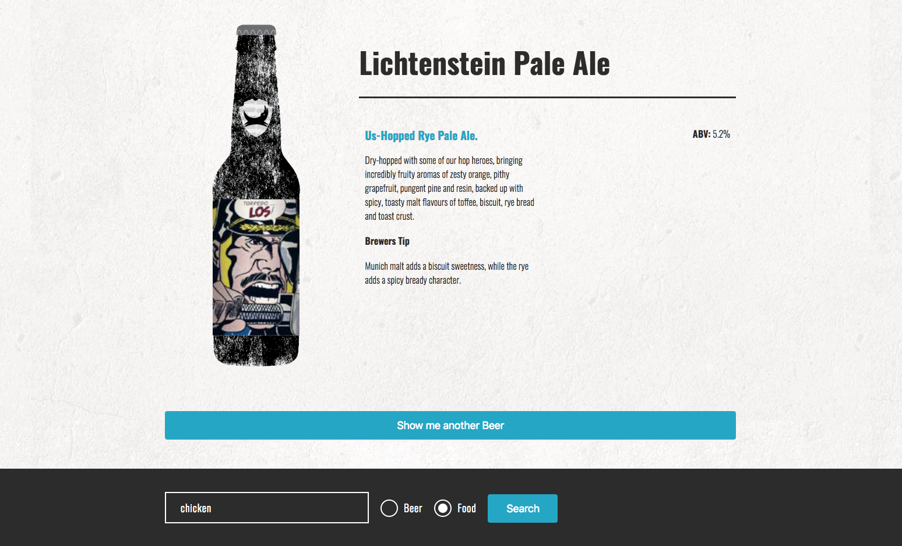
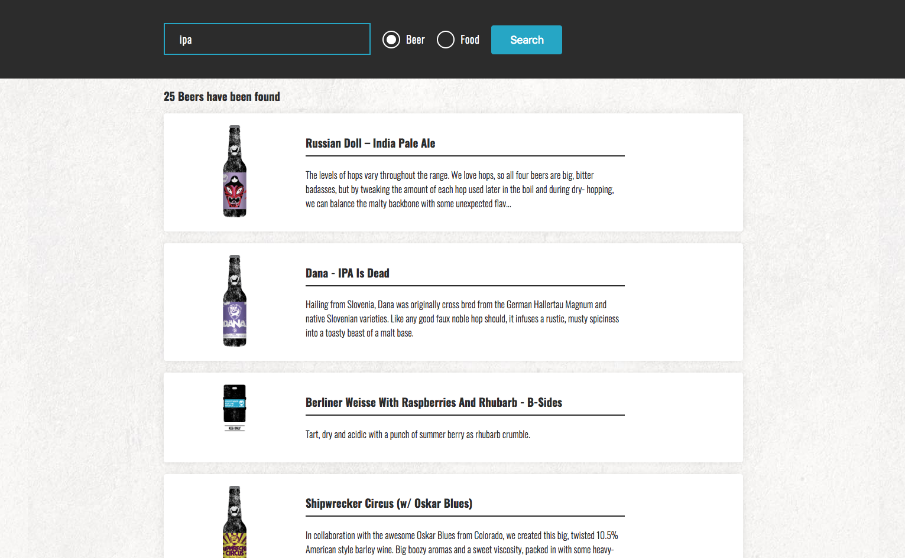

Beer App
---
React application loading Brewdog beers via the Punk API [full documentation](https://punkapi.com/documentation/v2).

Created with *create-react-app*. See the [full create-react-app guide](https://github.com/facebookincubator/create-react-app/blob/master/packages/react-scripts/template/README.md).

Install
---

`npm install`

Usage
---

`npm start`

Test
---

`npm test`

Features
---

Detail view shows random beer including title, image, description, brewers tip and ABV. Button loads new random beer from Brewdog collection.

Search provides user with beers based on the search term and search option. 

Open Required Todos
---

- [ ] advanced testing
- [ ] advanced use of design patterns 
- [ ] advanced use of React components and their interaction

Open Additional Todos
---

- [ ] empty search result message
- [ ] loading animations / loading spinner
- [ ] buffer the next random call to avoid loading delays i.e. image
- [ ] Optimising wireframe / app structure - Search bar and results are not present enough
- [ ] make search result list items clickable to display the selected beer in the detail view

